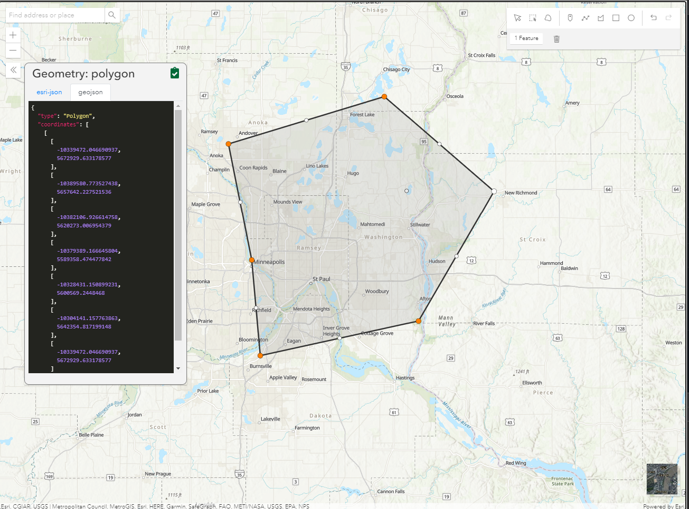

# restapi

This is a Python API for working with ArcGIS REST API, ArcGIS Online, and Portal/ArcGIS Enterprise.  This package has been designed to work with [arcpy](https://pro.arcgis.com/en/pro-app/arcpy/get-started/what-is-arcpy-.htm) when available, or the included open source module [pyshp](https://pypi.org/project/pyshp/).  It will try to use arcpy if available for some data conversions, otherwise will use open source options. Also included is a subpackage for administering ArcGIS Server Sites.  This is updated often, so continue checking here for new functionality!

### Why would you use this package?

Esri currently provides the [ArcGIS API for Python](https://developers.arcgis.com/python/) which provides complete bindings to the ArcGIS REST API.  This package has less coverage of the REST API, but has many convience functions not available in the ArcGIS API for Python and has a strong focus on downloading and querying data.  This package will also support older versions of Python (i.e. 2.7.x) whereas Esri's package only supports 3.x.

## Release History

[Release History](ReleaseNotes.md)

## Installation

`restapi` is supported on Python 2.7 and 3.x. It can be found on [Github](https://github.com/Bolton-and-Menk-GIS/restapi) and [PyPi](https://pypi.org/project/bmi-arcgis-restapi/). To install using pip:

````sh
pip install bmi-arcgis-restapi
````

After installation, it should be available to use in Python:

````py
import restapi
````

## A note about `arcpy`

By default, `restapi` will import Esri's `arcpy` module if available. However, this module is not required to use this package.  `arcpy` is only used when available to write data to disk in esri specific formats (file geodatabase, etc) and working with `arcpy` Geometries.  When `arcpy` is not availalbe, the  [pyshp](https://pypi.org/project/pyshp/) module is used to write data (shapefile format only) and work with `shapefile.Shape` objects (geometry).  Also worth noting is that open source version is much faster than using `arcpy`.

That being said, there may be times when you want to force `restapi` to use the open source version, even when you have access to `arcpy`.  Some example scenarios being when you don't need to write any data in an Esri specific format, you want the script to execute very fast, or you are working in an environment where `arcpy` may not play very nicely ([Flask](https://palletsprojects.com/p/flask/), [Django](https://www.djangoproject.com/), etc.).  To force `restapi` to use the open source version, you can simply create an environment variable called `RESTAPI_USE_ARCPY` and set it to `FALSE` or `0`.  This variable will be checked before attempting to import `arcpy`.

Here is an example on how to force open source at runtime:

```py
import os
os.environ['RESTAPI_USE_ARCPY'] = 'FALSE'

# now import restapi
import restapi
```

## requests.exceptions.SSLError

If you are seeing `requests.exceptions.SSLError` exceptions in `restapi` >= 2.0, this is probaly due to a change in handling servers without valid SSL certificates. Because many ArcGIS Server instances are accessed using SSL with a self-signed certificate, or through a MITM proxy like Fiddler, `restapi` < 2.0 defaulted to ignoring SSL errors by setting the `request` client's `verify` option to `False`. The new default behavior is to enable certificate verification. If you are receiving this error, you are probably accessing your server with a self-signed certificate, or through a MITM proxy. If that is not the case, you should investigate why you are seeing SSL errors, as there would likely be an issue with the server configuration, or some other security issues.

To mimic the previous behavior in the newer versions of `restapi`, there are 2 options - disable certificate verification (less secure), or [build a custom CA bundle ](https://requests.readthedocs.io/en/stable/user/advanced/#ssl-cert-verification) which includes any self-signed certificates needed to access your server (more secure). Both of these can be done using the new [restapi.RequestClient()](#requestclient) feature.

````py
import restapi
import requests
session = requests.Session()
client = restapi.RequestClient(session)
restapi.set_request_client(client)

# Disable verification
client.session.verify = False

# -or-

# Use custom CA bundle
client.session.verify = '/path/to/certfile'
````

Since `verify = False` is a commonly used setting when dealing with ArcGIS Server instances, it's also possible to use an environment variable. The variable must be set before `restapi` is imported.

````py
os.environ['RESTAPI_VERIFY_CERT'] = 'FALSE'
import restapi
````

## Connecting to an ArcGIS Server

> samples for this section can be found in the [connecting_to_arcgis_server.py](./restapi/samples/connecting_to_arcgis_server.py) file.

One of the first things you might do is to connect to a services directory (or catalog):

````py
import restapi

# connect to esri's sample server 6
rest_url = 'https://sampleserver6.arcgisonline.com/arcgis/rest/services'

# connect to restapi.ArcServer instance 
ags = restapi.ArcServer(rest_url)
````

```py
>>> # get folder and service properties
>>> print('Number of folders: {}'.format(len(ags.folders)))
>>> print('Number of services: {}\n'.format(len(ags.services)))
>>> 
>>> # walk thru directories
>>> for root, services in ags.walk():
>>>     print('Folder: {}'.format(root))
>>>     print('Services: {}\n'.format(services))

Number of folders: 13
Number of services: 60

Folder: None
Services: ['911CallsHotspot/GPServer', '911CallsHotspot/MapServer', 'Census/MapServer', 'CharlotteLAS/ImageServer', 'CommercialDamageAssessment/FeatureServer', 'CommercialDamageAssessment/MapServer', 'CommunityAddressing/FeatureServer', 'CommunityAddressing/MapServer', '<...>', 'Water_Network/MapServer', 'Wildfire/FeatureServer', 'Wildfire/MapServer', 'WindTurbines/MapServer', 'World_Street_Map/MapServer', 'WorldTimeZones/MapServer']

Folder: AGP
Services: ['AGP/Census/MapServer', 'AGP/Hurricanes/MapServer', 'AGP/USA/MapServer', 'AGP/WindTurbines/MapServer']

Folder: Elevation
Services: ['Elevation/earthquakedemoelevation/ImageServer', 'Elevation/ESRI_Elevation_World/GPServer', 'Elevation/GlacierBay/MapServer', 'Elevation/MtBaldy_Elevation/ImageServer', 'Elevation/WorldElevations/MapServer']

# ..etc
```

#### Connecting to a child service

from an `ArcServer` instance, you can connect to any service within that instance by providing a child path or wildcard search match.

````py
# connect to a specific service
# using just the service name (at the root)
usa = ags.getService('USA') #/USA/MapServer -> restapi.common_types.MapService

# using the relative path to a service in a folder
census = ags.getService('AGP/Census') #/AGP/Census/MapServer -> restapi.common_types.MapService

# can also just use the service name, but be weary of possible duplicates
infastructure = ags.getService('Infrastructure') #/Energy/Infrastructure/FeatureServer -> restapi.common_types.FeatureService

# using a wildcard search
covid_cases = ags.getService('*Covid19Cases*') #/NYTimes_Covid19Cases_USCounties/MapServer -> restapi.common_types.MapService
````

check outputs:

```py
>>> for service in [usa, census, infastructure, covid_cases]:
>>>     print('name: "{}"'.format(service.name))
>>>     print('repr: "{}"'.format(repr(service)))
>>>     print('url: {}\n'.format(service.url))

name: "USA"
repr: "<MapService: USA/MapServer>"
url: https://sampleserver6.arcgisonline.com/arcgis/rest/services/USA/MapServer

name: "Census"
repr: "<MapService: AGP/Census/MapServer>"
url: https://sampleserver6.arcgisonline.com/arcgis/rest/services/AGP/Census/MapServer

name: "Infrastructure"
repr: "<FeatureService: Energy/Infrastructure/FeatureServer>"
url: https://sampleserver6.arcgisonline.com/arcgis/rest/services/Energy/Infrastructure/FeatureServer

name: "NYTimes_Covid19Cases_USCounties"
repr: "<MapService: NYTimes_Covid19Cases_USCounties/MapServer>"
url: https://sampleserver6.arcgisonline.com/arcgis/rest/services/NYTimes_Covid19Cases_USCounties/MapServer
```

### Working with layers

> samples for this section can be found in the [working_with_layers.py](./restapi/samples/working_with_layers.py) file.

You can connect to `MapServiceLayer`s or `FeatureLayer`s directly by passing the url, or by accessing from the parent `FeatureService` or `MapService`.

also query the layer and get back arcpy.da Cursor like access

```py
# get access to the "Cities" layer from USA Map Service
cities = usa.layer('Cities') # or can use layer id: usa.layer(0)

# query the map layer for all cities in California with population > 100000
where = "st = 'CA' and pop2000 > 100000"

# the query operation returns a restapi.FeatureSet or restapi.FeatureCollection depending on the return format
featureSet = cities.query(where=where)

# get result count, can also use len(featureSet)
print('Found {} cities in California with Population > 100K'.format(featureSet.count))

# print first feature (restapi.Feature).  The __str__ method is pretty printed JSON
# can use an index to fetch via its __getitem__ method
print(featureSet[0])
```

#### exceeding the `maxRecordCount`

In many cases, you may run into issues due to the `maxRecordCount` set for a service, which by default is `1000` features.  This limit can be exceeded by using the `exceed_limit` parameter.  If `exceed_limit` is set to `True`, the `query_in_chunks` method will be called internally to keep fetching until all queried features are returned.

```py
# fetch first 1000
first1000 = cities.query()
print('count without exceed_limit: {}'.format(first1000.count)) # can also use len()

# fetch all by exceeding limit
allCities = cities.query(exceed_limit=True)
print('count without exceed_limit: {}'.format(len(allCities)))
```

check outputs:

```py
Found 57 cities in California with Population > 100K
{
  "type": "Feature",
  "geometry": {
    "type": "Point",
    "coordinates": [
      -117.88976896399998,
      33.836165033999976
    ]
  },
  "properties": {
    "areaname": "Anaheim"
  }
}
count without exceed_limit: 1000
total records: 3557
count with exceed_limit: 3557
```

#### using a search cursor

A query can also be done by using a search cursor, which behaves very similarly to the [arcpy.da.SearchCursor](https://pro.arcgis.com/en/pro-app/latest/arcpy/data-access/searchcursor-class.htm).  While the `restapi.Cursor` does support usage of a `with` statement, it is not necessary as there is no file on disk that is opened.  When using the `cursor()` method on a `MapServiceLayer` or `FeatureLayer` it will actually make a call to the ArcGIS Server and will return a tuple of values based on the `fields` requested.  The default `fields` value is `*`, which will return all fields.  Like the arcpy cursors, the `SHAPE@` token can be used to fetch geometry, while the `OID@` token will fetch the object id.

```py
# if you don't want the json/FeatureSet representation, you can use restapi cursors
# for the query which are similar to the arcpy.da cursors. The `SearchCursor` will return a tuple
cursor = restapi.SearchCursor(cities, fields=['areaname', 'pop2000', 'SHAPE@'], where=where)
for row in cursor:
    print(row)
````

check outputs:

```py
('Anaheim', 328014, <restapi.shapefile.Shape object at 0x000002B1DE232400>)
('Bakersfield', 247057, <restapi.shapefile.Shape object at 0x000002B1DE232470>)
('Berkeley', 102743, <restapi.shapefile.Shape object at 0x000002B1DE232400>)
('Burbank', 100316, <restapi.shapefile.Shape object at 0x000002B1DE232470>)
('Chula Vista', 173556, <restapi.shapefile.Shape object at 0x000002B1DE232400>)
('Concord', 121780, <restapi.shapefile.Shape object at 0x000002B1DE232470>)
('Corona', 124966, <restapi.shapefile.Shape object at 0x000002B1DE232400>)
# ... etc
```

also supports `with` statements:

```py
with restapi.SearchCursor(cities, fields=['areaname', 'pop2000', 'SHAPE@'], where=where) as cursor:
    for row in cursor:
        print(row)
```

In the above examples, when the `SearchCursor` is instantiated, it actually kicked off a new query for the cursor results.  If you already have a `FeatureSet` or `FeatureCollection` like we did above, you can also save a network call by constructing the `restapi.Cursor` from the feature set by doing:

```py
featureSet = cities.query(where=where)

# can pass in fields as second argument to limit results
cursor = restapi.Cursor(featureSet, ['areaname', 'pop2000', 'SHAPE@'])
```

> note: Both the `MapServiceLayer` and `FeatureLayer` also have a `searchCursor()` convenience method, which will allow you to use the same functionality as shown above but without passing in the layer itself:
> `rows = cities.searchCursor(['areaname', 'pop2000', 'SHAPE@'])`

#### exporting features from a layer

Data can also be easily exported from a `FeatureLayer` or `MapServicelayer`.  This can be done by exporting a feature set directly or from the layer itself:

```py
# set output folder
out_folder = os.path.join(os.path.expanduser('~'), 'Documents', 'restapi_samples')

# create output folder if it doesn't exist
if not os.path.exists(out_folder):
    os.makedirs(out_folder)

# output shapefile
shp = os.path.join(out_folder, 'CA_Cities_100K.shp')

# export layer from map service
cities.export_layer(shp, where=where)
```

You can also export a feature set directly if you already have one loaded:

```py
restapi.exportFeatureSet(featureSet, shp)
```

exporting layers or feature sets also supports a `fields` filter, where you can limit which fields are exported. Other options are supported as well such as an output spatial reference.  One important thing to note, if you do not have access to `arcpy`, you can only export to shapefile format.  If you do have `arcpy`, any output format supported by esri will work.  If the output is a [geodatabase feature class](https://desktop.arcgis.com/en/arcmap/latest/manage-data/feature-classes/a-quick-tour-of-feature-classes.htm), you can also choose to include things like [domains](https://desktop.arcgis.com/en/arcmap/latest/manage-data/geodatabases/an-overview-of-attribute-domains.htm) if applicable.

```py
# exporting features 
out_folder = os.path.join(os.path.expanduser('~'), 'Documents', 'restapi_samples')
if not os.path.exists(out_folder):
    os.makedirs(out_folder)
shp = os.path.join(out_folder, 'CA_Cities_100K.shp')

# export layer to a shapefile
cities.export_layer(shp, where=where)

# if there is an existing feature set, you can also export that directly
# restapi.exportFeatureSet(featureSet, shp)
```

### selecting features by geometry

Both the `MapServiceLayer` and `FeatureLayer` support arcgis spatial selections using [arcgis geometry](https://developers.arcgis.com/documentation/common-data-types/geometry-objects.htm) objects. The `select_layer_by_location` method will return a `FeatureSet` or `FeatureCollection`, while the `clip` method will actually export the spatial selection to a shapffile or Feature Class (latter only available with `arcpy`).

#### the `geometry-helper` application

This package now includes a [geometry-helper](geometry-helper/README.md) application that can be used to quickly create geometries and copy the geometry in either `esri-json` or `geojson` format to form geometry necessary to make queries:



to open this application in a web browser, simply call:

```py
restapi.open_geometry_helper()
```

#### select by location

to select a layer by location, first create a geometry object as json (can be esri or geojson format) and make the selection:

```py
# select layer by location
universities_url = 'https://services1.arcgis.com/Hp6G80Pky0om7QvQ/arcgis/rest/services/Colleges_and_Universities/FeatureServer/0'

# get feature layer
universities = restapi.FeatureLayer(universities_url)
print('universities: ', repr(universities))

# form geometry (do not have to cast to restapi.Geometry, this will happen under the hood automatically)
geometry = restapi.Geometry({
  "spatialReference": {
    "latestWkid": 3857,
    "wkid": 102100
  },
  "rings": [
    [
      [
        -10423340.4579098,
        5654465.8453829475
      ],
      [
        -10324889.565478457,
        5654465.8453829475
      ],
      [
        -10324889.565478457,
        5584449.527473665
      ],
      [
        -10423340.4579098,
        5584449.527473665
      ],
      [
        -10423340.4579098,
        5654465.8453829475
      ]
    ]
  ]
})

# make selection
featureCollection = universities.select_by_location(geometry)
print('Number of Universities in Twin Cities area: {}'.format(featureCollection.count))

# can also export the feature collection directly or call the clip() method (makes a new call to server)
universities_shp = os.path.join(out_folder, 'TwinCities_Univiersities.shp')
universities.clip(geometry, universities_shp)
```

check outputs:

```py
universities:  <FeatureLayer: "CollegesUniversities" (id: 0)>
total records: 50
Number of Universities in Twin Cities area: 50
total records: 50
Created: "L:\Users\calebma\Documents\restapi_samples\TwinCities_Univiersities.shp"
Fetched all records
```

## FeatureLayer Editing

> samples for this section can be found in the [feature_layer_editing.py](./restapi/samples/feature_layer_editing.py) file.

This package also includes comprehensive support for working with [FeatureLayers](https://enterprise.arcgis.com/en/portal/latest/use/feature-layers.htm).  These are editable layers hosted by an ArcGIS Server, Portal, or ArcGIS Online.  A `FeatureLayer` is an extension of the `MapServiceLayer` that supports editing options.

#### add features using `FeatureLayer.addFeatures()`

```py
# connect to esri's Charlotte Hazards Sample Feature Layer for incidents
url = 'https://services.arcgis.com/V6ZHFr6zdgNZuVG0/ArcGIS/rest/services/Hazards_Uptown_Charlotte/FeatureServer/0'

# instantiate a FeatureLayer
hazards = restapi.FeatureLayer(url)

# create a new feature as json
feature = {
  "attributes" : { 
    "HazardType" : "Road Not Passable", 
    "Description" : "restapi test", 
    "SpecialInstructions" : "Contact Dispatch", 
    "Priority" : "High",
    "Status": "Active"
  }, 
  "geometry": create_random_coordinates()
}

# add json feature
adds = hazards.addFeatures([ feature ])
print(adds)
```

check outputs:

```py
Added 1 feature(s)
{
  "addResults": [
    {
      "globalId": "8B643546-7253-4F0B-80DE-2DE8F1754C03",
      "objectId": 11858,
      "success": true,
      "uniqueId": 11858
    }
  ]
}
```

#### add an attachment

```py
# add attachment to new feature using the OBJECTID of the new feature
oid = adds.addResults[0].objectId
image = os.path.join(os.path.abspath('...'), 'docs', 'images', 'geometry-helper.png')
attRes = hazards.addAttachment(oid, image)
print(attRes)

# now query attachments for new feature
attachments = hazards.attachments(oid)
print(attachments)
```

check outputs:

```py
Added attachment '211' for feature objectId
{
  "addAttachmentResult": {
    "globalId": "f370a4e0-3976-4809-b0d5-f5d1b5990b4b",
    "objectId": 211,
    "success": true
  }
}
[<Attachment ID: 211 (geometry-helper.png)>]
```

#### update features

```py
# update the feature we just added, payload only has to include OBJECTID and any fields to update
updatePayload = [
  { 
    "attributes": { 
      "OBJECTID": r.objectId, 
      "Description": "restapi update" 
    } 
  } for r in adds.addResults
]
updates = hazards.updateFeatures(updatePayload)
print(updates)
```

check outputs:

```py
Updated 1 feature(s)
{
  "updateResults": [
    {
      "globalId": null,
      "objectId": 11858,
      "success": true,
      "uniqueId": 11858
    }
  ]
}
```

#### delete features

```py
# delete features by passing in a list of objectIds
deletePayload = [r.objectId for r in updates.updateResults]
deletes = hazards.deleteFeatures(deletePayload)
print(deletes)
```

check outputs:

```py
Deleted 1 feature(s)
{
  "deleteResults": [
    {
      "globalId": null,
      "objectId": 11858,
      "success": true,
      "uniqueId": 11858
    }
  ]
}
```

### feature editing with `restapi` cursors

`restapi` also supports cursors similar to what you get when using `arcpy`.  However, these work directly with the REST API and JSON features while also supporting `arcpy` and `shapefile` geometry types.  See the below example on how to use an `insertCursor` to add new records:

#### adding features with an `InsertCursor`

New records can be added using an `InsertCursor`.  This can be instantiated using the `InsertCursor` class itself, or by calling the `insertCursor` method of a `FeatureLayer`.  When called as `FeatureLayer.insertCursor`, the layer itself will not need to be passed in.

```py
>>> # add 5 new features using an insert cursor 
>>> # using this in a "with" statement will call applyEdits on __exit__
>>> fields = ["SHAPE@", 'HazardType', "Description", "Priority"]
>>> with restapi.InsertCursor(hazards, fields) as irows:
      for i in list(range(1,6)):
          desc = "restapi insert cursor feature {}".format(i)
          irows.insertRow([create_random_coordinates(), "Wire Down", desc, "High"])

Added 5 feature(s)
```

Any time an insert or update cursor will save changes, it will print a short message showing how many features were affected.  You can always get at the raw edit information from the `FeatureLayer` by calling the `editResults` property.  This will be an array that stores the results of every `applyEdits` operation, so the length will reflect how many times edits have been saved.

```py
>>> # we can always view the results by calling FeatureLayer.editResults which stores
>>> # an array of edit results for each time applyEdits() is called.
>>> print(hazards.editResults)
[{
  "addResults": [
    {
      "globalId": "2774C9ED-D8F8-4B71-9F37-B26B40790710",
      "objectId": 12093,
      "success": true,
      "uniqueId": 12093
    },
    {
      "globalId": "18411060-F6FF-49FB-AD91-54DB65C13D06",
      "objectId": 12094,
      "success": true,
      "uniqueId": 12094
    },
    {
      "globalId": "8045C840-F1B9-4BD2-AEDC-72F4D65EB7A6",
      "objectId": 12095,
      "success": true,
      "uniqueId": 12095
    },
    {
      "globalId": "EC9DB6FC-0D34-4B83-8C98-398C7B48666D",
      "objectId": 12096,
      "success": true,
      "uniqueId": 12096
    },
    {
      "globalId": "C709033F-DF3B-43B3-8148-2299E7CEE986",
      "objectId": 12097,
      "success": true,
      "uniqueId": 12097
    }
  ],
  "deleteResults": [],
  "updateResults": []
}]
```

> note: when using a `with` statement for the `InsertCursor` and `UpdateCursor` it will automatically call the `applyEdits()` method on `__exit__`, which is critical to submitting the new, deleted, or updated features to the server.  If not using a `with` statement, you will need to call `applyEdits()` manually after changes have been made.

#### updating features with an `UpdateCursor`

records can be updated or deleted with an `updateCursor` and a where clause.  Note that the `OBJECTID` field must be included in the query to indicate which records will be updated.  The `OID@` field token can be used to retreive the `objectIdFieldName`:

```py
>>> # now update records with updateCursor for the records we just added. Can use the 
>>> # editResults property of the feature layer to get the oids of our added features
>>> addedOids = ','.join(map(str, [r.objectId for r in hazards.editResults[0].addResults]))
>>> whereClause = "{} in ({})".format(hazards.OIDFieldName, addedOids)
>>> with restapi.UpdateCursor(hazards, ["Priority", "Description", "OID@"], where=whereClause) as rows:
        for row in rows:
            if not row[2] % 2:
                # update rows with even OBJECTID's
                row[0] = "Low"
                rows.updateRow(row)
            else:
                # delete odd OBJECTID rows
                print('deleting row with odd objectid: ', row[2])
                rows.deleteRow(row)
      
Updated 2 feature(s)
Deleted 3 feature(s)   

>>> # now delete the rest of the records we added
>>> whereClause = "Description like 'restapi%'"
>>> with restapi.UpdateCursor(hazards, ["Description", "Priority", "OID@"], where=whereClause) as rows:
        for row in rows:
            rows.deleteRow(row)
                irows.insertRow([create_random_coordinates(), "Wire Down", desc, "High"])

Deleted 2 feature(s)
```

#### attachment editing

Offline capabilities (Sync)

````py
# if sync were enabled, we could create a replica like this:
# can pass in layer ID (0) or name ('incidents', not case sensative)
replica = fs.createReplica(0, 'test_replica', geometry=adds[0]['geometry'], geometryType='esriGeometryPoint', inSR=4326)

# now export the replica object to file geodatabase (if arcpy access) or shapefile with hyperlinks (if open source)
restapi.exportReplica(replica, folder)
````

Working with Image Services
---------------------------

````py
url = 'http://pca-gis02.pca.state.mn.us/arcgis/rest/services/Elevation/DEM_1m/ImageServer'
im = restapi.ImageService(url)

# clip DEM
geometry = {"rings":[[
                [240006.00808044084, 4954874.19629429],
                [240157.31010183255, 4954868.8053006204],
                [240154.85966611796, 4954800.0316874133],
                [240003.55764305394, 4954805.4226145679],
                [240006.00808044084, 4954874.19629429]]],
            "spatialReference":{"wkid":26915,"latestWkid":26915}}

tif = os.path.join(folder, 'dem.tif')
im.clip(geometry, tif)

# test point identify
x, y = 400994.780878, 157878.398217
elevation = im.pointIdentify(x=x, y=y, sr=103793)
print(elevation)
````

Geocoding
---------

````py
# hennepin county, MN geocoder
henn = 'http://gis.hennepin.us/arcgis/rest/services/Locators/HC_COMPOSITE/GeocodeServer'
geocoder = restapi.Geocoder(henn)
# find target field, use the SingleLine address field by default
geoResult = geocoder.findAddressCandidates('353 N 5th St, Minneapolis, MN 55403')

# export results to shapefile
print('found {} candidates'.format(len(geoResult))
geocoder.exportResults(geoResult, os.path.join(folder, 'target_field.shp'))

# Esri geocoder
esri_url = 'http://sampleserver1.arcgisonline.com/ArcGIS/rest/services/Locators/ESRI_Geocode_USA/GeocodeServer'
esri_geocoder = restapi.Geocoder(esri_url)

# find candidates using key word arguments (**kwargs) to fill in locator fields, no single line option
candidates = esri_geocoder.findAddressCandidates(Address='380 New York Street', City='Redlands', State='CA', Zip='92373')
print('Number of address candidates: {}'.format(len(candidates)))
for candidate in candidates:
    print(candidate.location)

# export results to shapefile
out_shp = os.path.join(folder, 'Esri_headquarters.shp')
geocoder.exportResults(candidates, out_shp)
````

Geoprocessing Services
----------------------

````py
# test esri's drive time analysis GP Task
gp_url = 'http://sampleserver1.arcgisonline.com/ArcGIS/rest/services/Network/ESRI_DriveTime_US/GPServer/CreateDriveTimePolygons'
gp = restapi.GPTask(gp_url)

# get a list of gp parameters (so we know what to pass in as kwargs)
print('\nGP Task "{}" parameters:\n'.format(gp.name)
for p in gp.parameters:
    print('\t', p.name, p.dataType)

point = {"geometryType":"esriGeometryPoint",
         "features":[
             {"geometry":{"x":-10603050.16225853,"y":4715351.1473399615,
                          "spatialReference":{"wkid":102100,"latestWkid":3857}}}],
         "sr":{"wkid":102100,"latestWkid":3857}}

# run task, passing in gp parameters as keyword arguments (**kwargs)
gp_res = gp.run(Input_Location=str(point), Drive_Times = '1 2 3', inSR = 102100)

# returns a GPResult() object, can get at the first result by indexing (usually only one result)
# can test if there are results by __nonzero__()
if gp_res:
    result = gp_res.results[0]
  
    # this returned a GPFeatureRecordSetLayer as an outputParameter, so we can export this to polygons
    print('\nOutput Result: "{}", data type: {}\n'.format(result.paramName, result.dataType))

    # now export the result value to fc (use the value property of the GPResult object from run())
    drive_times = os.path.join(folder, 'drive_times.shp')
    restapi.exportFeatureSet(drive_times, gp_res.value)
````

A note about input Geometries
-----------------------------

restapi will try to use arcpy first if you have it, otherwise will defer to open source.  Both
support the reading of shapefiles to return the first feature back as a restapi.Geometry object

It also supports arcpy Geometries and shapefile.Shape() objects

````py
>>> shp = r'C:\TEMP\Polygons.shp' # a shapefile on disk somewhere
>>> geom = restapi.Geometry(shp)
>>> print(geom.envelope())
-121.5,38.3000000007,-121.199999999,38.6000000015
````

Token Based Security
--------------------

restapi also supports secured services.  This is also session based, so if you sign in once to an
ArcGIS Server Resource (on the same ArcGIS Site), the token will automatically persist via the
IdentityManager().

There are 3 ways to authticate:

````py
# **kwargs for all accessing all ArcGIS resources are
# usr   -- username
# pw    -- password
# token -- token (as string or restapi.Token object)
# proxy -- url to proxy

# secured url
secured_url = 'http://some-domain.com/arcgis/rest/services'

# 1. username and password
ags = restapi.ArcServer(url, 'username', 'password')  # token is generated and persists

# 2. a token that has already been requested
ags = restapi.ArcServer(url, token=token)  # uses a token that is already active

# 3. via a proxy (assuming using the standard esri proxy)
#   this will forward all subsequent requests through the proxy
ags = restapi.ArcServer(url, proxy='http://some-domain.com/proxy.ashx')
````

You can even just generate a token and let the IdentityManager handle the rest.  It is even smart enough to handle multiple tokens for different sites:

```py
# login to instance 1
usr = 'username'
pw = 'password'

# urls to two different ArcGIS Server sites
url_1 = 'http://some-domain.com/arcserver1/rest/services'
url_2 = 'http://domain2.com/arcgis/rest/services'

# generate tokens
tok1 = restapi.generate_token(url_1, usr, pw)
tok2 = restapi.generate_token(url_2, usr, pw)

# now we should be able to access both ArcGIS Server sites via the IdentityManager
arcserver1 = restapi.ArcServer(url_1) # tok1 is automatically passed in and handled
arcserver2 = restapi.ArcServer(url_2) # tok2 is used here
```

The admin Subpackage
--------------------

restapi also contains an administrative subpackage (warning: most functionality has not been tested!).  You can import this module like this:

```py
from restapi import admin
```

### Connecting to a Portal

```py
url = 'https://domain.gis.com/portal/home'
portal = admin.Portal(url, 'username', 'password')

# get servers
servers = portal.servers

# stop sample cities service
server = servers[0]

service = server.service('SampleWorldCities.MapServer')
service.stop()

```

To connect to an ArcGIS Server instance that you would like to administer you can do the following:

```py
# test with your own servers
url = 'localhost:6080/arcgis/admin/services' #server url
usr = 'username'
pw = 'password'

# connect to ArcGIS Server instance
arcserver = admin.ArcServerAdmin(url, usr, pw)
```

To list services within a folder, you can do this:

```py
folder = arcserver.folder('SomeFolder')  # supply name of folder as argument
for service in folder.iter_services():
    print(service.serviceName, service.configuredState

    # can stop a service like this
    # service.stop()

    # or start like this
    # service.start()

print('\n' * 3)

# show all services and configured state (use iter_services to return restapi.admin.Service() object!)
for service in arcserver.iter_services():
    print(service.serviceName, service.configuredState)
```

Security
--------

You can set security at the folder or service level.  By default, the addPermssion() method used by Folder and Service objects will make the service unavailable to the general public and only those in the administrator role can view the services.  This is done by setting the 'esriEveryone' principal "isAllowed" value to false.  You can also assign permissions based on roles.

```py
arcserver.addPermission('SomeFolder')  # by default it will make private True 

# now make it publically avaiable (unsecure)
arcserver.addPermission('SomeFolder', private=False)

# secure based on role, in this case will not allow assessor group to see utility data
#   assessor is name of assessor group role, Watermain is folder to secure
arcserver.addPermission('Watermain', 'assessor', False)  

# note, this can also be done at the folder level:
folder = arcserver.folder('Watermain')
folder.addPermission('assessor', False)
```

Stopping and Starting Services
------------------------------

Services can easily be started and stopped with this module.  This can be done from the ArcServerAdmin() or Folder() object:

```py
# stop all services in a folder
arcserver.stopServices(folderName='SomeFolder') # this can take a few minutes

# look thru the folder to check the configured states, should be stopped
for service in arcserver.folder('SomeFolder').iter_services():
    print(service.serviceName, service.configuredState)

# now restart
arcserver.startServices(folderName='SomeFolder') # this can take a few minutes

# look thru folder, services should be started
for service in arcserver.folder('SomeFolder').iter_services():
    print(service.serviceName, service.configuredState)
  
# to do this from a folder, simply get a folder object back
folder = arcserver.folder('SomeFolder')
folder.stopServices()
for service in folder.iter_services():
    print(service.serviceName, service.configuredState)
```

Updating Service Properties
---------------------------

The admin package can be used to update the service definitions via JSON.  By default, the Service.edit() method will pass in the original service definition as JSON so no changes are made if no arguments are supplied.  The first argument is the service config as JSON, but this method also supports keyword arguments to update single properties (**kwargs).  These represent keys of a the dictionary in Python.

```py
# connect to an individual service (by wildcard) - do not need to include full name, just
# enough of the name to make it a unique name query
service = arcserver.service('SampleWorldCities') #provide name of service here

# get original service description
description = service.description

# now edit the description only by using description kwarg (must match key exactly to update)
service.edit(description='This is an updated service description')

# edit description again to set it back to the original description
service.edit(description=description)
```

There are also some helper methods that aren't available out of the box from the ArcGIS REST API such as enabling or disabling extensions:

```py
# disable Feature Access and kml downloads
service.disableExtensions(['FeatureServer', 'KmlServer'])

# you can also list enabled/disabled services
print(service.enabledExtensions)
# [u'KmlServer', u'WFSServer', u'FeatureServer']

service.disabledExtensions
# [u'NAServer', u'MobileServer', u'SchematicsServer', u'WCSServer', u'WMSServer']

# Edit service extension properites
# get an extension and view its properties
fs_extension = service.getExtension('FeatureServer')

print(fs_extension) # will print as pretty json
```

For Service objects, all properties are represented as pretty json.  Below is what the FeatureService Extension looks like:

```py
{
  "allowedUploadFileTypes": "", 
  "capabilities": "Query,Create,Update,Delete,Uploads,Editing", 
  "enabled": "true", 
  "maxUploadFileSize": 0, 
  "properties": {
    "allowGeometryUpdates": "true", 
    "allowOthersToDelete": "false", 
    "allowOthersToQuery": "true", 
    "allowOthersToUpdate": "false", 
    "allowTrueCurvesUpdates": "false", 
    "creatorPresent": "false", 
    "dataInGdb": "true", 
    "datasetInspected": "true", 
    "editorTrackingRespectsDayLightSavingTime": "false", 
    "editorTrackingTimeInUTC": "true", 
    "editorTrackingTimeZoneID": "UTC", 
    "enableOwnershipBasedAccessControl": "false", 
    "enableZDefaults": "false", 
    "maxRecordCount": "1000", 
    "realm": "", 
    "syncEnabled": "false", 
    "syncVersionCreationRule": "versionPerDownloadedMap", 
    "versionedData": "false", 
    "xssPreventionEnabled": "true", 
    "zDefaultValue": "0"
  }, 
  "typeName": "FeatureServer"
}
```

Setting properties for extensions is also easy:

```py
# set properties for an extension using helper method, use **kwargs for setting capabilities
service.setExtensionProperties('FeatureServer', capabilities='Query,Update,Delete,Editing')

# verify changes were made
print(fs_extension.capabilities
# 'Query,Update,Delete,Editing'

# alternatively, you can edit the service json directly and call the edit method
# change it back to original settings
fs_extension.capabilities = 'Query,Create,Update,Delete,Uploads,Editing'
service.edit()

# verify one more time...
print(fs_extension.capabilities)
# 'Query,Create,Update,Delete,Uploads,Editing'
```

Access the Data Store
---------------------

You can iterate through the data store items easily to read/update/add items:

```py
# connect to the server's data store
ds = arcserver.dataStore

# iterate through all items of data store
for item in ds:
    print(item.type, item.path
    # if it is an enterprise database connection, you can get the connection string like this
    if item.type == 'egdb':
        print(item.info.connectionString)
    # else if a folder, print(server path
    elif item.type == 'folder':
        print(item.info.path)
    print('\n')
```

User and Role Stores
--------------------

When viewing usernames/roles you can limit the number of names returned using the "maxCount" keyword argument.  To view and make changes to Role Store:

```py
# connect to role store
rs = arcserver.roleStore

# print roles
for role in rs:
    print(role)

# find users within roles
for role in rs:
    print(role, 'Users: ', rs.getUsersWithinRole(role))

# add a user to role
rs.addUsersToRole('Administrators', 'your-domain\\someuser')

# remove user from role
rs.removeUsersFromRole('Administrators', 'your-domain\\someuser')

# remove an entire role
rs.removeRole('transportation')
```

To view and make changes to the User Store:

```py
# connect to user store
us = arcserver.userStore

# get number of users
print(len(us)

# iterate through first 10 users
for user in us.searchUsers(maxCount=10):
    print(user)
  
# add new user
us.addUser('your-domain\\someuser', 'password')

# assign roles by using comma separated list of role names
us.assignRoles('your-domain\\someuser', 'Administrators,Publishers')

# get privileges from user
us.getPrivilegeForUser('your-domain\\someuser')

# remove roles from user 
us.removeRoles('your-domain\\someuser', 'Administrators,Publishers')
```

Log Files
---------

You can easily query server log files like this:

```py
import restapi
import datetime

# query log files (within last 3 days), need to convert to milliseconds
threeDaysAgo = restapi.date_to_mil(datetime.datetime.now() - relativedelta(days=3))
for log in arcserver.queryLogs(endTime=threeDaysAgo, pageSize=25):
    print(log.time
    for message in log:
        print(message)
    print('\n')
```

A note about verbosity
----------------------

When using the admin subpackage you will likely be making changes to services/permissions etc.  On operations that change a configuration, the @passthrough decorator will report back if the operation is successful and return results like this:

```py
{u'status': u'SUCCESS'}
```

The printing of these messages can be shut off by changing the global "VERBOSE" variable so these messages are not reported.  This can be disabled like this:

```py
admin.VERBOSE = False 
```

## Advanced Usage

### RequestClient

From version 2.0, it is possible to use a custom `requests.Session()` instance. This instance can be defined globally for all requests made by `restapi`, or it can be passed on each function call as a `restapi.RequestClient()` object. This can be useful if different parameters are needed to access different servers.

Use this functionality to access servers behind HTTP or SOCKS proxies, to disable certificate validation or use custom CA certificates, or if additional authentication is needed. Refer to the [requests.Session()](https://requests.readthedocs.io/en/master/user/advanced/#session-objects) documentation for details

```py
# Create a restapi.RequestClient() object.
custom_session = requests.Session()
custom_client = restapi.RequestClient(custom_session)

# Customize the client
proxies = {
 “http”: “http://10.10.10.10:8000”,
 “https”: “http://10.10.10.10:8000”,
}
custom_client.session.proxies = proxies
custom_client.session.headers['Source-Client'] = 'Custom'

# Use the client for an individual call
rest_url = 'https://gis.ngdc.noaa.gov/arcgis/rest/services'
arcserver = restapi.ArcServer(rest_url, client=custom_client)

# Set a different client as client as restapi's default
global_session = requests.Session()
global_client = restapi.RequestClient(global_session)
global_client.session.headers['Source-Client'] = 'Global'
restapi.set_request_client(global_client)

# Now any call made by restapi will use the custom client
arcserver = restapi.ArcServer(rest_url)

# The global client can also be accessed directly
restapi.requestClient.headers['Another-Header'] = 'Header is here'

```

Any session objects which extend `requests.Session()` should be supported, for example, [pypac.PACSession()](https://pypi.org/project/pypac/).

## Exceptions

The module `restapi.exceptions` contains the following custom exceptions, which correspond to the ESRI REST error returns codes specified in the [ESRI documentation](https://developers.arcgis.com/net/reference/platform-error-codes/#http-network-and-rest-errors). Other, previously unknown returns codes will raise the generic `RestAPIException`:


| code | Exception Class | 
| ------ | ------ |
| 400 | RestAPIUnableToCompleteOperationException |
| 401 | RestAPIAuthorizationRequiredException |
| 403 | RestAPITokenValidAccessDeniedException |
| 404 | RestAPINotFoundException |
| 413 | RestAPITooLargeException |
| 498 | RestAPIInvalidTokenException |
| 499 | RestAPITokenRequiredException |
| 500 | RestAPIErrorPerforningOperationException |
| 501 | RestAPINotImplementedException |
| 504 | RestAPIGatewayTimeoutException |
